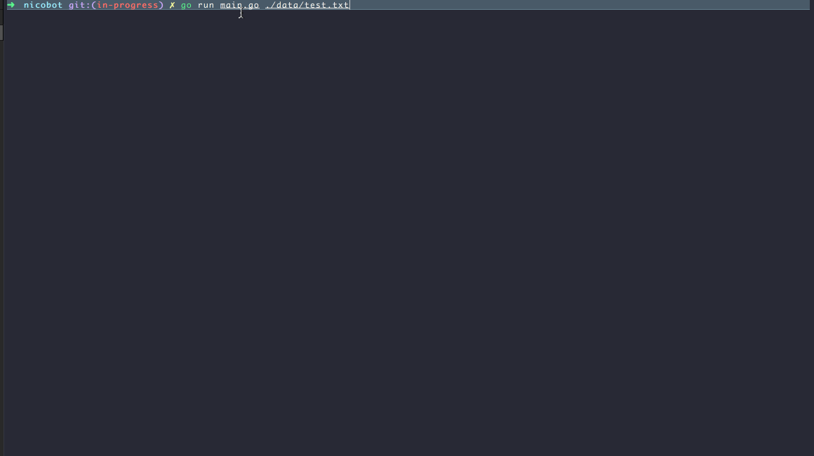
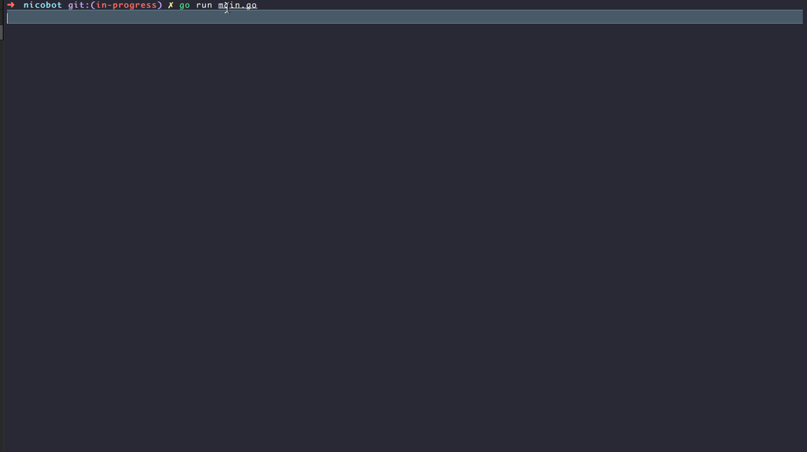

# NicoBot

[](https://goreportcard.com/report/github.com/nicored/nicobot) [](https://travis-ci.org/nicored/nicobot) [](https://coveralls.io/github/nicored/nicobot?branch=master)

## Overview

NicoBot is a little red bot that travels on a table of
5x5 units. You can either give it instructions from a text
file, or enter them manually.

## Demonstration

### Using a file with instruction (./data/test.txt)



### Using the user interface



## How to install

The following command will install nicobot binary to your $GOBIN
```go
$ go get github.com/nicored/nicobot
````

## How to use it

### Providing a text file with instructions
```go
$ go nicobot <filepath>
````

The text file would look something like that:
```text
PLACE 0,0,NORTH
MOVE
EAST
MOVE
MOVE
NORTH
REPORT
```

### From STDIN
```go
$ go nicobot
```

And you can enter your commands to the bot when prompted.

### COMMANDS
The possible commands are

#### PLACE X,Y,F
- To place the bot on the table. You can place it outside of the table
but you won't be able to move it.
- X is a number representing the units on a row
- Y is a number representing the units in a column
- F is the direction the bot is facing (NORTH, EAST, SOUTH, WEST)

#### LEFT
Rotates the bot 90 degrees to the left

#### RIGHT
Rotates the bot 90 degrees to the right

#### MOVE
Moves the bot one unit forward, in the direction is is currently facing

